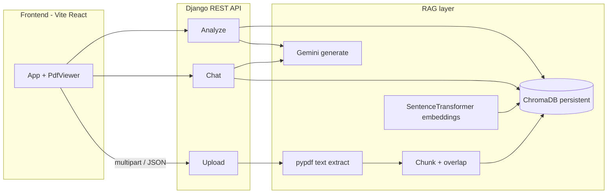

# RAG-Based Chat PDF

A full-stack **retrieval-augmented generation (RAG)** application for **question answering over PDF documents**. Upload a PDF, index it into a local vector store, then chat with **page-grounded answers** and **clickable citations** that jump to the right page in the built-in viewer. Optional **document analysis** produces a bullet summary and suggested follow-up questions using the same retrieval pipeline.

The UI is branded **ChatPDF Pro AI** in the frontend (`frontend/src/App.tsx`).

---

## Features

- **PDF upload** — Drag-and-drop or file picker; server stores the file and builds an index in one step.
- **In-browser PDF viewer** — React + `react-pdf` with page navigation synced to citation chips.
- **RAG chat** — Retrieves the most relevant text chunks, then asks **Google Gemini** to answer **only from those excerpts**, with instructions to cite pages (e.g. `(p. 3)`).
- **Citations** — Each reply includes citation chips (page + short snippet); clicking a chip opens that page.
- **Analyze document** — Retrieves broad-context chunks and asks Gemini (JSON mode) for a **summary bullet list** and **five suggested questions**.
- **Dark / light theme** — Persisted in `localStorage`.
- **Remove document** — Deletes the stored PDF file and the associated ChromaDB collection.

---

## Architecture



**Flow (simplified):**

1. **Ingest** — `pypdf` extracts text per page → text is split into overlapping chunks (900 characters, 120 overlap) → chunks are embedded with **`all-MiniLM-L6-v2`** (SentenceTransformers) and stored in **ChromaDB** under a collection per document.
2. **Chat** — User query is embedded; **top-k** similar chunks are retrieved → excerpts (with page labels) are sent to **Gemini** with a strict system prompt (answer only from context, cite pages).
3. **Analyze** — A fixed retrieval query pulls diverse chunks → Gemini returns structured JSON: `summary[]` and `suggested_questions[]`.

---

## Tech stack

| Layer | Technology |
|--------|------------|
| Backend | **Django 5**, **Django REST Framework** |
| Vector DB | **ChromaDB** (persistent on disk) |
| Embeddings | **sentence-transformers** (`all-MiniLM-L6-v2`) |
| LLM | **Google Gemini** (`google-genai` SDK) |
| PDF text | **pypdf** |
| Frontend | **React 18**, **TypeScript**, **Vite 5**, **Tailwind CSS** |
| PDF UI | **react-pdf** |

---

## Repository layout

```
RAG_Based_Chat_PDF/
├── backend/
│   ├── api/                 # REST app: views, rag_service, pdf_extract
│   ├── rag_project/         # Django settings, urls, wsgi
│   ├── requirements.txt
│   ├── manage.py
│   ├── .env                 # local secrets (gitignored) — create from example below
│   ├── db.sqlite3           # created on migrate (gitignored)
│   ├── media/pdfs/          # uploaded PDFs (gitignored)
│   └── chroma_data/         # Chroma persistence (gitignored)
└── frontend/
    ├── src/
    │   ├── App.tsx
    │   ├── api.ts           # fetch helpers; uses same-origin /api in dev via proxy
    │   └── components/
    ├── vite.config.ts       # dev server + proxy to Django
    └── package.json
```

---

## Prerequisites

- **Python** 3.10+ (recommended; matches Django 5 and current dependency stacks)
- **Node.js** 18+ and npm (for the Vite frontend)
- A **Google AI (Gemini) API key** — [Google AI Studio](https://aistudio.google.com/apikey) or your Google Cloud setup

**Note:** First run will download the SentenceTransformer model (`all-MiniLM-L6-v2`) and may take a few minutes depending on your network.

---

## Backend setup

From the repository root:

```bash
cd backend
python -m venv venv
```

**Windows (PowerShell):**

```powershell
.\venv\Scripts\Activate.ps1
pip install -r requirements.txt
```

**macOS / Linux:**

```bash
source venv/bin/activate
pip install -r requirements.txt
```

Create `backend/.env` (this path is loaded explicitly by `rag_project/settings.py`):

```env
# Required for chat and analyze
GEMINI_API_KEY=AIzasdkjfbjdshbfvITSFAKEOBVISOUSLY

# Optional — default shown
GEMINI_MODEL=gemini-2.5-flash

# Optional Django settings
DJANGO_SECRET_KEY=change-me-in-production
DJANGO_DEBUG=1
DJANGO_ALLOWED_HOSTS=localhost,127.0.0.1

# Optional — Chroma persistence directory (default: backend/chroma_data)
# CHROMA_PATH=D:/path/to/chroma_data
```

Run migrations and start the server:

```bash
python manage.py migrate
python manage.py runserver 127.0.0.1:8000
```

The API is served at `http://127.0.0.1:8000/api/...`.

---

## Frontend setup

In a **second** terminal:

```bash
cd frontend
npm install
npm run dev
```

The dev server runs on **port 5173** and proxies `/api` and `/media` to Django (`vite.config.ts`), so the frontend can call relative URLs with an empty base (`frontend/src/api.ts`).

Open **http://localhost:5173** in your browser.

---

## API reference

Base URL (local): `http://127.0.0.1:8000`

| Method | Path | Description |
|--------|------|-------------|
| `POST` | `/api/documents/upload/` | Multipart form field **`file`**: PDF only. Returns `document_id`, filename, size, `pages`, `chunks`. |
| `POST` | `/api/documents/<uuid>/analyze/` | JSON body can be `{}`. Returns `{ summary: string[], suggested_questions: string[] }`. Requires `GEMINI_API_KEY`. |
| `POST` | `/api/documents/<uuid>/chat/` | JSON `{ "message": "..." }`. Returns `{ answer, citations: [{ page, snippet }] }`. Requires `GEMINI_API_KEY`. |
| `GET` | `/api/documents/<uuid>/pdf/` | Raw PDF bytes (`application/pdf`). |
| `DELETE` | `/api/documents/<uuid>/` | Removes PDF from disk and deletes the Chroma collection. |

**Errors:** Validation issues typically return `400` with `{ "detail": "..." }`. Missing Gemini configuration or upstream failures may return `503` with a `detail` message.

---

## Configuration (environment)

| Variable | Purpose |
|----------|---------|
| `GEMINI_API_KEY` | Required for chat and analyze endpoints. |
| `GEMINI_MODEL` | Gemini model id (e.g. `gemini-2.5-flash`) or `models/...` form; see `settings.py`. |
| `DJANGO_SECRET_KEY` | Django secret; change for any shared or production deployment. |
| `DJANGO_DEBUG` | Set to `0` in production. |
| `DJANGO_ALLOWED_HOSTS` | Comma-separated hostnames. |
| `CHROMA_PATH` | Directory for ChromaDB persistence. |

**CORS:** In development, `http://localhost:5173` and `http://127.0.0.1:5173` are allowed (`settings.py`). Add your production frontend origin before deploying.

---

## Limitations and tips

- **Scanned PDFs** — Text must be extractable. Image-only scans yield little or no text; retrieval and answers will be poor unless you add OCR.
- **Chunk size** — Fixed at 900 characters with 120 overlap (`rag_service.py`). Very long equations or tables may be split awkwardly.
- **Embeddings** — Local CPU/GPU runs SentenceTransformers; large documents increase ingest time and disk use under `chroma_data/`.
- **Security** — The API uses `csrf_exempt` on document views for simple JSON/multipart clients; for public internet deployment, tighten authentication, HTTPS, file size limits, and rate limiting as needed.

---

## Production notes (high level)

- Set `DJANGO_DEBUG=0`, a strong `DJANGO_SECRET_KEY`, and `DJANGO_ALLOWED_HOSTS` / `CORS_ALLOWED_ORIGINS` to your real domains.
- Serve the SPA and API under one **reverse proxy** (e.g. nginx) so `/api` hits Django and static files hit the built frontend, **or** configure the frontend build to point at your API base URL (today `api.ts` uses `""` for same-origin).
- Do not commit `backend/.env`, `venv`, `media/`, or `chroma_data/` (already in `.gitignore`).

---

## Scripts summary

| Location | Command | Purpose |
|----------|---------|---------|
| `backend/` | `python manage.py runserver` | API server |
| `frontend/` | `npm run dev` | Dev UI + proxy |
| `frontend/` | `npm run build` | Production build → `frontend/dist` |

---

## License

No license file is included in this repository yet. Add a `LICENSE` of your choice if you plan to distribute or open-source the project publicly.
